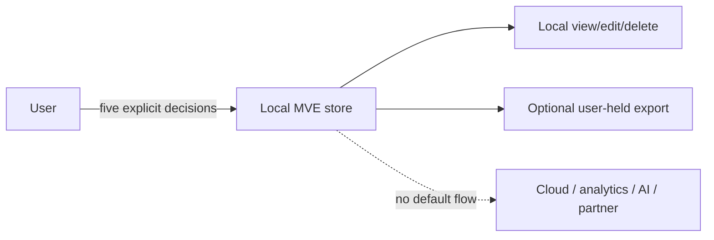
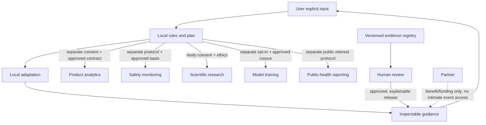

# Cycle 3 Canonical Protection Layer and Learning Governance

- Issue: #22
- Branch: `codex/22-privacy-architecture`
- Date: 2026-07-16
- Status: privacy/security architecture; not a compliance, anonymity, or implementation claim
- Canonical owner: Thread 07 (`BL-PLC-01`)

## Decision Frame

| Required question | Cycle 3 answer |
| --- | --- |
| User problem | Protection, learning, evidence, and partner features can create invisible sensitive flows, stale authority, and controls that users cannot inspect, recover, or remove. |
| Expected benefit | A canonical contract and separate purpose governance may keep every layer truthful, minimal, consented, recoverable, and removable. Benefit is unvalidated. |
| Supporting evidence | Source-verified fact: GDPR defines personal data and requires principles including purpose limitation, minimization, and storage limitation; exact application requires counsel. NIST provides guidance for evaluating differential-privacy guarantees, not approval of this design. |
| Required data | First MVE: local five-decision plan only. Future layers require contract metadata, exact policy/receipt, permissions, health, minimum configuration, recovery, inventory, and teardown evidence; no raw explicit content/history. |
| Consent requirements | Product control and legal basis are decided per purpose. Personal adaptation, analytics, safety, research, model training, and public-health reporting are never interchangeable. |
| Safety risks | Lockout, care/access interference, coercion, false protection, stale restore, sensitive exposure, profiling, and inaccessible recovery. |
| Misuse risks | Partner/employer surveillance, hidden training, vulnerability targeting, cross-purpose reuse, coercive ally control, public-health re-identification, and cultural stereotyping. |
| Platform feasibility | Platform limitation: browser/OS/account/network ownership, backup, restore, uninstall, and deletion differ. No layer is approved without conformance evidence. |
| Success metric | Complete contract/inventory mapping; zero high-privilege orphans; purpose/consent comprehension; recovery/teardown success; no stale reactivation; measurable adverse effects and residuals. |
| Exit strategy | Quiesce, recover essential access, revoke, remove, verify, disclose partial/external residuals, reset/delete learning, and retire layers that cannot conform. |

## Canonical Protection Layer Contract: `BL-PLC-01`

Every browser, OS, account, device, network, sync, notification, ally-message, analytics, research, model, partner, and public-health adapter must supply one versioned contract before research beyond static concepts.

| Contract section | Required fields |
| --- | --- |
| Identity | Layer/adapter ID and version, vendor/platform version, owner, maintainer, status, countries, expiry. |
| Capability | Exact actions, scope grammar, unsupported combinations, known bypasses, guarantees explicitly not made. |
| User problem/benefit | Specific need, evidence classification, transfer distance, adjacent safer option, success and harm measures. |
| Data flow | Every source, field/class, transformation, destination, recipient/processor, direction, frequency, trigger, and prohibited field. |
| Purpose/legal questions | One or more of the six purpose IDs; necessity; candidate legal basis/Article 9/ePrivacy questions; counsel/DPIA status. |
| Consent/control | Exact preview, receipt version, activation, withdrawal, material-change invalidation, no-bundle proof, user-visible state. |
| Permission/security | OS/browser/account grant, privilege, key/token location, expiry/rotation/revocation, supply chain, staff access/audit. |
| Health/truth | Observable health inputs, check cadence, unknown state, degraded behavior, user copy, no false aggregate status. |
| Essential access | Safety, healthcare, accessibility, account recovery, work/legal obligations, immediate safety-recovery exception. |
| Recovery | Legitimate-use, lost device/credential, coercion, compromise, offline, provider outage, replacement device, factory reset. |
| Inventory | Every created rule/profile/token/key reference/role/store/cache/notification/copy and mapping to current receipt. |
| Retention/rights | Store, duration/trigger, backup/restore, access, export, rectify, restrict, object, delete, legal exception, residual. |
| Learning | Rule/input, local/global location, inspect/explain/edit/reset/delete, training status, update authority, rollback. |
| Teardown | Quiesce/revoke/remove/verify order, rollback/safe state, external step, partial result, retry owner/deadline. |
| Verification | Test environment/version, synthetic inputs, expected/observed results, evidence, pass/fail, independent reviewer. |
| Exit | Retirement trigger, migration, user communication, evidence/incident retention, orphan closeout. |

Repository decision: missing contract fields produce `Off/Blocked`, not an inferred default. Thread 01 owns raw platform capability/adapters (`BL-CAP-01`); Thread 07 owns the canonical privacy/consent/recovery/teardown contract.

## Data-Flow Architecture

### First MVE

Repository decision: the first MVE is local, accountless, Supportive-only, no-sync, no-analytics, no-peer, no-reward, no-model-learning, and non-clinical.

### Future governed flows

No arrow in the future diagram exists by default. Each requires a separate contract, purpose decision, legal/ethics review, data map, consent/control where appropriate, and teardown.

## Six Purpose Separations

| ID | Purpose | Default | Candidate data | Forbidden transfer/claim | Required governance |
| --- | --- | --- | --- | --- | --- |
| P1 | Personal adaptation | Local and off until user chooses a rule | Explicit preference, selected content/action, local feedback | Does not authorize analytics, safety, research, training, or reporting | Inspect/explain/edit/reset/delete; no hidden inference. |
| P2 | Product analytics | Off in first MVE | Approved D0/D1 operational events only after necessity proof | No intimate event funnel, ad tech, session replay, or proxy outcome optimization | Separate choice where required, schema allowlist, DPIA/ePrivacy review, short retention. |
| P3 | Safety monitoring | Off unless a defined capability needs it | Minimum incident/security event under written policy | Not product analytics, engagement, diagnosis, emergency guarantee, or training | Safety/legal basis, human accountability, incident retention/rights, error/appeal audit. |
| P4 | Scientific research | Off | Protocol-specific coded data | Product consent/access does not authorize research; withdrawal limits disclosed | Ethics, lawful basis/Article 9, study consent where applicable, analysis/publication plan. |
| P5 | Model training | Off; no-training default | Only an independently approved, rights-cleared, purpose-specific corpus | No automatic use of plans, stories, chats, reports, telemetry, or research data | Separate opt-in if ever appropriate, provenance/rights, deletion/withdrawal limits, model governance. |
| P6 | Public-health reporting | Off | Approved aggregate/statistical output only | No individual intervention, small-cell exposure, partner access, diagnosis, or universal burden claim | Public-interest decision, disclosure review, ethics/counsel, geography/equity, versioned methodology. |

Repository decision: consent for one purpose never authorizes another. Consent may be an inappropriate basis for some safety/legal processing; counsel must decide purpose-specific basis rather than stretching consent.

## Local Personalization and Learning Controls

Allowed first candidates are deterministic local rules based only on explicit choices: language, secular/spiritual preference, content depth, voice/text, accessibility, chosen action, and `show less/more like this`.

The user must be able to:

- inspect `what the system learned`, source input, rule, date, effect, and evidence/content version;
- explain why a suggestion appeared in plain language;
- edit a preference without recreating a history;
- reset one rule, a category, or all adaptation;
- delete learning and verify resulting state;
- choose no-save/one-time behavior;
- turn off adaptation without losing core safety, recovery, exit, care, or essential support;
- retain `no model training` independently of every other choice.

Prohibited inference: religion, sexuality, relationship form, diagnosis, trauma, criminality, moral worth, abstinence status, incapacity, mental state, relapse risk, or vulnerability from behavior. Country, culture, occupation, routine, household, support, and professional-care context require explicit input, necessity, and separate review; absence is not inferred.

## Privacy-Preserving Analytics Research Gate

Federated learning, secure aggregation, differential privacy, or on-device aggregation are research candidates, not privacy guarantees.

Before any proposal:

1. State the exact decision that aggregate data would change and why local/user research cannot answer it.
2. Define adjacency, privacy unit, threat model, attacker knowledge, contribution bounds, parameters/budget, composition, central/local trust, dropouts, and deletion implications.
3. Measure utility and privacy across minority/small groups; prohibit small-cell or rare-context release.
4. Obtain independent statistical privacy/security review, DPIA/legal decision, ethics/equity review, and precise user claim language.
5. Publish versioned parameters/limitations internally and stop if benefit does not justify residual risk.

Source-verified fact: NIST guidance describes evaluation considerations for differential-privacy guarantees. It does not establish that differential privacy is appropriate or sufficient here: https://www.nist.gov/publications/guidelines-evaluating-differential-privacy-guarantees

## Evidence and Content Update Governance

- Evidence records contain source/date/population/intervention/outcomes/harms/bias/applicability/uncertainty/rights and are owned by Thread 02.
- A new paper or automated alert cannot change user guidance, protection, care, learning, or model behavior.
- Human scientific, clinical/safety, rights, cultural/accessibility, privacy, and product owners approve their relevant parts.
- Every release has content/evidence version, rationale, affected population, claim classification, rollback target, expiry, and user-facing `why guidance changed` note where material.
- Updates never silently change a user's plan, mode, protection, recovery, consent, data purpose, or care route.
- Rollback removes the affected release and preserves minimum incident/change evidence without restoring withdrawn personal data.

## Partner and Cultural Separation

Partners, employers, payers, sponsors, NGOs, public-health bodies, AI/model providers, and fellowship organizations receive no intimate plan, behavior, story, stage, mode, setback, care, protection, reward, or learning event by default.

- Funding/benefit eligibility uses the minimum non-sensitive proof approved by legal/equity review.
- A partner cannot rank content, set modes, condition care, demand surveillance, revoke recovery, or infer recovery status.
- Partner purpose, data, contract, access, retention, audit, incident, withdrawal, exit, and non-endorsement are separate from user product data.
- Cultural/religious/secular variants are user-chosen and source-reviewed; the system does not infer identity or essentialize a group.
- Subgroup harm, translation, accessibility, and stereotype review precede release; a user can change/reset/delete the preference.

## Printable or User-Held Recovery Inventory

The future inventory may be printed or exported locally only after exact preview. It must use neutral labels and exclude intimate goal/content/history.

Required entries: inventory version/date; user-chosen alias; devices/browser profiles/accounts/networks with active product artifacts; policy/receipt IDs; mode and finite expiry; permission/token/key-reference location without secret values; recovery steps; essential-access exceptions; adapter owner; last verified health; teardown/manual provider steps; external residuals; emergency/clinical non-coverage; and stale/unknown status.

Risks shown before export: loss, coercive discovery, shoulder surfing, printer/cloud spool, backup, recipient copies, and staleness. The user may omit optional rows, generate no-save view, revoke obsolete inventory, and compare current state. No QR code or secret capable of account/protection recovery is included by default.

## Immediate Safety-Recovery Exception

Ordinary downgrade friction never delays:

- safety from coercion or relationship abuse;
- healthcare, emergency, accessibility, legal, work-critical, or account-recovery access;
- response to compromised device/account/ally/credential;
- correcting harmful overbreadth or lockout;
- teardown of unauthorized/hidden enrollment.

The immediate path restores the minimum necessary access, suspends social notifications/external dependency, records only minimal local security evidence where lawful, shows what remains active, and offers later review. It does not diagnose danger or contact anyone automatically.

## Factory Reset and Replacement Device

| Scenario | Required behavior | Critical failure |
| --- | --- | --- |
| Factory reset, no user-held inventory | New install starts off/accountless; no stale protection or learning reactivates. Explain local data loss. | Hidden restore or claim of current protection. |
| Factory reset with OS/cloud backup | Reconcile receipt/version/expiry/tombstone before showing data; active control stays off pending explicit confirmation. | Deleted/expired Strict or D3 data becomes active. |
| Replacement device | Treat as new/untrusted; user-held inventory supports inspection only, not automatic authority. Re-enroll permissions separately. | Old device state copied as current consent. |
| Old device returns online | Compare versions and revocations; stale device cannot upload/activate; show unresolved residual. | Last-write-wins restores withdrawn data/purpose. |
| Lost old device | Revoke sessions/tokens where available; rotate user-controlled keys; list externally owned residuals. | Social actor/provider becomes sole recovery authority. |
| Device unavailable during teardown | Mark partial with owner/deadline; propagate approved tombstone/expiry; never report complete. | False complete deletion/teardown. |

Ally co-approval and recovery-share custody are prohibited. Recovery remains user-controlled and must not require a peer, sponsor, partner, employer, or moderator.

## Verification Program

Required synthetic test families: fresh install; permission grant/revoke; data-flow allowlist; purpose withdrawal; learning inspect/reset/delete; factory reset; backup restore; replacement device; offline stale device; version conflict; immediate safety recovery; partial provider outage; lost credential/device; cross-user/shared account; teardown/reinstall; orphan reconciliation; partner isolation; and evidence release rollback.

Only a completed run with environment/version, input, expected result, observed result, evidence location, and pass/fail may be labeled `Executed test result`.

## Primary Governance Sources

- GDPR consolidated text: https://eur-lex.europa.eu/eli/reg/2016/679/oj
- EDPB controller/processor guideline hub: https://www.edpb.europa.eu/guidelines-relevant-for-controllers-and-processors_en
- NIST differential-privacy evaluation guidance: https://www.nist.gov/publications/guidelines-evaluating-differential-privacy-guarantees

Research procedure executed: these authoritative sources were reviewed on 2026-07-16 for definitions, governance questions, and privacy-evaluation framing. No legal opinion, DPIA, or compliance conclusion was produced.

## Verification and Terminal Status

- Repository-state verified: changes are architecture/research documentation only.
- Desk-review observation: `BL-PLC-01`, six purposes, diagrams, local learning controls, inventory, reset/replacement, immediate recovery, and teardown are explicit.
- Not performed: DPIA, legal-basis decision, security/privacy test, adapter conformance, user comprehension, factory reset, recovery, deletion, model, analytics, or public-health reporting test.

Terminal status: **Ready for DPIA, security, AI governance, platform teardown, coercion, and accessibility review. No personal-data or implementation authorization.**
